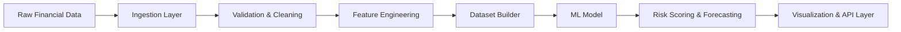

# 🚀 AI Risk Manager

**AI Risk Manager** is a full-stack financial intelligence platform that enables businesses to **ingest, process, analyze, and forecast financial data** using a combination of data pipelines, machine learning, and analytical dashboards.

It is designed as a **modular, production-oriented system** that transforms raw financial datasets into actionable insights such as **client risk scoring, anomaly detection, and revenue forecasting**.

---

## ✨ Core Capabilities

* 📥 **Data Ingestion Pipeline**

  * Supports structured financial datasets (clients, invoices, transactions)
  * Handles CSV uploads and manual entries
  * Modular ingestion layer (`ingestion.py`, `manual_entry.py`)

* 🧹 **Data Validation & Transformation**

  * Schema validation and cleaning (`validator.py`)
  * Feature mapping and normalization (`mapper.py`)
  * Dataset construction pipeline (`dataset_builder.py`, `data_pipelining.py`)

* 🧠 **Machine Learning Risk Engine**

  * Predictive risk scoring for clients
  * Behavioral analysis based on transaction patterns
  * Model training & inference pipeline (`train_model.py`, `models.py`)

* 📈 **Forecasting Engine**

  * Time-based financial forecasting (`forecast.py`)
  * Revenue trend prediction and future projections

* ⚠️ **Business Risk Analysis**

  * Rule-based + ML hybrid risk evaluation (`business_risk.py`)
  * Identification of high-risk clients and financial anomalies

* 📊 **Visualization Layer**

  * Interactive dashboards (Chart.js)
  * Client-level and global financial insights (`visualizer.py`)

* 🌐 **API Layer**

  * FastAPI-powered REST backend (`api.py`, `main.py`)
  * Clean separation between data processing and presentation

---

## 🧠 System Design Philosophy

AI Risk Manager is built with a **pipeline-first architecture**, where each stage is modular and independently extensible:



### Key Design Principles

* **Separation of Concerns** — ingestion, validation, modeling, and visualization are decoupled
* **Pipeline Modularity** — each stage can be independently improved or replaced
* **Extensibility** — supports new data sources and models
* **Production-Oriented Design** — not a notebook-based ML project

---

## 🧩 Tech Stack

### Backend

* FastAPI (API layer)
* Python (core logic)
* Pandas / NumPy (data processing)

### Machine Learning

* Scikit-learn (model training & inference)

### Frontend

* HTML / CSS / JavaScript
* Chart.js (visualization)

---

## 📂 Project Structure

```id="projstruct"
AI-Risk-Manager/
│
├── core/
│   ├── ingestion.py          # Data ingestion (CSV, manual)
│   ├── validator.py          # Data validation
│   ├── mapper.py             # Feature mapping
│   ├── data_pipelining.py    # End-to-end pipeline orchestration
│   ├── dataset_builder.py    # Dataset construction
│   ├── business_risk.py      # Risk scoring logic
│   ├── forecast.py           # Forecasting engine
│   ├── models.py             # ML models
│   ├── visualizer.py         # Data visualization logic
│   └── api.py                # API endpoints
│
├── frontend/
│   ├── dashboard.html
│   ├── forecast.html
│   ├── clients.html
│   ├── upload.html
│   ├── manual.html
│   ├── *.js
│   └── style.css
│
├── data/
│   ├── clients.csv
│   ├── invoices.csv
│   └── transactions.csv
│
├── models_saved/
│   └── churn_model.pkl
│
├── train_model.py            # Model training pipeline
├── main.py                  # FastAPI entrypoint
└── README.md
```

---

## ⚙️ Setup & Installation

### 1. Clone Repository

```bash
git clone https://github.com/krishanudeka/AI-Risk-Manager.git
cd AI-Risk-Manager
```

---

### 2. Install Dependencies

```bash
pip install -r requirements.txt
```

---

### 3. Run Backend

```bash
uvicorn main:app --reload
```

Server runs at:

```
http://127.0.0.1:8000
```

---

## 🧪 End-to-End Workflow

1. Upload financial datasets (clients, invoices, transactions)
2. Data is validated and cleaned
3. Features are engineered and mapped
4. Dataset is constructed for modeling
5. ML model predicts risk scores
6. Forecasting module predicts future trends
7. Results are visualized in dashboards

---

## 📊 Example Insights Generated

* High-risk clients based on payment behavior
* Revenue trends and future projections
* Detection of abnormal financial activity
* Client segmentation based on risk

---

## 🧠 What Makes This Project Stand Out

Unlike typical ML projects:

* ❌ Not a single notebook
* ❌ Not just model training

✔ End-to-end pipeline system
✔ Real-world data handling
✔ Modular architecture
✔ Integrated visualization
✔ API-driven design

---

## 🚧 Future Enhancements

* Real-time streaming data pipeline
* Advanced anomaly detection (fraud detection)
* Deep learning forecasting models
* Cloud deployment (AWS/GCP)
* Role-based authentication & multi-user support
* Integration with accounting APIs (QuickBooks, Stripe)

---

## 👨‍💻 Author

**Krishanu Deka**
GitHub: https://github.com/krishanudeka

---

## ⭐ Support

If you find this project useful, consider giving it a ⭐ on GitHub.
